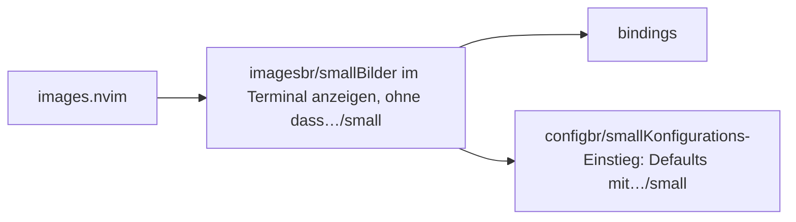
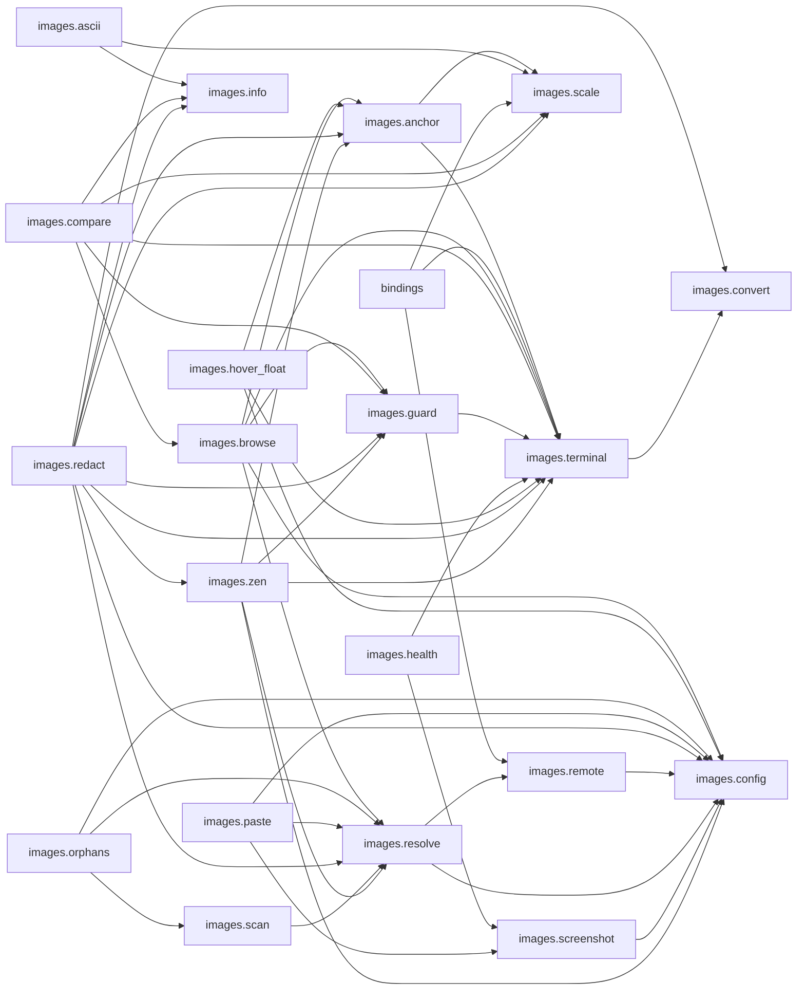

# images.nvim — module map

> **Generated** by `documentation`. Do not edit by hand — run `:DocMap`
> (or `nvim --headless -l scripts/gen_map.lua`) to regenerate.

**2 modules** · 2 namespaces · 25 helper files

The [interactive map](index.html) has filtering, full descriptions and
source links; this page is the version the code host renders directly.

## Namespaces

## Dependencies

Which parts of the tree require which, rolled up to the second level.
The [interactive map](index.html)'s **Deps** view has this per module,
in both directions, with load-time and lazy requires told apart.

## Modules

| Module | Description | Fns | Docs |
|---|---|---|---|
| `images` | Bilder im Terminal anzeigen, ohne dass Neovim das Terminal verlässt. | 28 | [src](../../lua/images/init.lua) |
| &nbsp;&nbsp;`bindings` |  |  |  |
| &nbsp;&nbsp;`images.config` | Konfigurations-Einstieg: Defaults mit User-Optionen zusammenführen. | 2 | [src](../../lua/images/config/init.lua) |

## Drift

0 errors · 0 warnings · 3 info

No errors or warnings.

3 informational findings

| Check | Message |
|---|---|
| `missing-readme` | lua/images has no README.md |
| `missing-readme` | lua/images/config has no README.md |
| `unreferenced-module` | images.health is required by no other file in the tree |

